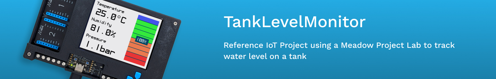

# TankLevelMonitor

Using a Project Lab and a distance sensor, build this reference project that monitors liquid levels on a container such as a cooler, bucket, or even a black 60L barrel.

## Projects
* [Hardware](#hardware)
* [Project Samples](#project-samples)
  * [TankLevelMonitor.Azure](#tanklevelmonitorazure)
  * [TankLevelMonitor.AzureFunction](#tanklevelmonitorazurefunction)
  * [TankLevelMonitor.Demo](#tanklevelmonitordemo)
  * [TankLevelMonitor.SQLite](#tanklevelmonitorsqlite)
  * [TankLevelMonitor.UI](#tanklevelmonitorui)
* [Support](#support)

## Hardware

On your Project Lab, connect a distance sensor like a Time Of Flight distance sensor (for a Bench prototype) on the I2c qwicc connector, or a MaxBotix (for a Lab prototype), fixed on the lid of a water cooler or whatever container you're using, for example: 

## Examining the TankLevelMonitor driver

Looking at the [TankLevelMonitor.Core](Source/TankLevelMonitor/), a few things worth mentioning:
 * `ITankLevelHardware` is an interface that defines what your IoT Project is composed of, which in this case, is a Project Lab and a sensor of type `IRangeFinder`, which are distance sensors.
 * `HardwareTypes` is an enum where you can have multiple hardware configurations. In this case, there is a `BenchPrototype` and a `LabPrototype`.
 * `TankLevelBenchPrototype` and `TankLevelLabPrototype` are `ITankLevelHardware` definitions where the only diference in this example is the distance sensor type.

## Project Samples

### [TankLevelMonitor.Azure](Source/TankLevelMonitor_Azure/)

This project sample reads Temperature, Humidity and Pressure from Project Lab's BME688 atmospheric sensor onboard, and gets the container's Volume, sending it to Azure IoT Hub.

### [TankLevelMonitor.AzureFunction](Source/TankLevelMonitor_AzureFunction/)

Azure Function project that is used receive incoming data from IoT Hub and updating a digital twin using Azure Digital Twins of the Tank Level Monitor. 

### [TankLevelMonitor.Demo](Source/TankLevelMonitor_Demo/)

Basic Getting Started app that shows the atmospheric and tank level readings on the Project Lab v3 display.

### [TankLevelMonitor.SQLite](Source/TankLevelMonitor_SQLite/)

Store atmospheric and tank level readings on SQLite running on Meadow.

### [TankLevelMonitor.UI](Source/TankLevelMonitor_UI/)

Speed up development build cycles by running Tank Level's UI screen straight from Windows using WinForms. Also learn how you can simulate a distance sensor by checking out the `SimulatedDistanceSensor` driver.

## Support

Having trouble running these samples? 
* File an [issue](https://github.com/WildernessLabs/Meadow.Desktop.Samples/issues) with a repro case to investigate, and/or
* Join our [public Slack](http://slackinvite.wildernesslabs.co/), where we have an awesome community helping, sharing and building amazing things using Meadow.